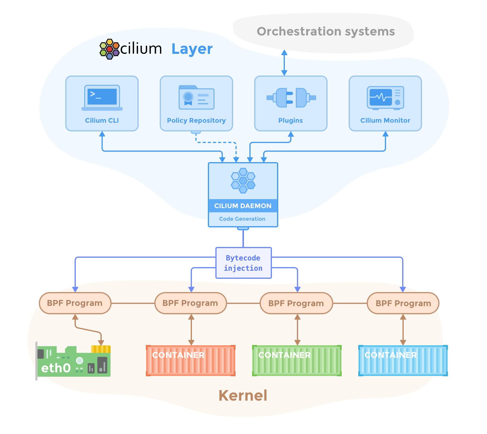

# 组成一览

一套Cilium加Hubble的部署包括以下组件：

## Cilium

### Agent

`cilium-agent`要运行在集群中的每一个节点上。这个agent通过Kubernetes或者API进行配置，包括网络拓扑、服务的负载均衡、网络策略、可见性及监控需求。

Cilium agent要监听来自编排系统的事件，比如Kubernetes，从而知晓容器或其他负载何时启停。它管理着eBPF程序，Linux内核用这些程序来控制容器间的网络访问。

### 调试工具CLI

调试工具（`cilium-dbg`）是一个命令行工具，跟Cilium agent一起安装的。它可以调用本机的Cilium agent的REST API。调试工具可以检查本机agent的数据和状态。而且还能直接访问eBPF map，检查它们的状态。

> 这里的调试工具不要跟`cilium`命令闹混了，后者是用来安装管理Kubernetes集群中的Cilium的命令行工具，通常不是安装在集群内，而是通过`kubeconfig`信息调用Kubernetes API远程访问集群。

### Operator

Cilium Operator用来处理那些整个集群层面的一次性工作，而非对每个结点的单次任务。它不参与网络策略和转发的关键路径。即便Operator出现临时性的不可用，集群通常也能正常运转。但是根据配置方面的差异，如果Operator不可用可能会导致：

    - [IP地址管理（IPAM）](../网络/相关概念/IP地址管理（IPAM）.md)出现延迟，继而导致新的负载调度会延迟，因为需要分配新的IP。
    - 无法更新kv存储中的心跳键，导致agent会认为kv存储不可用，继而触发重启。

### CNI插件

Pod调度或销毁时，Kubernetes会调用CNI插件（`cilium-cni`）。它要调用对应节点上的Cilium API，触发必需的datapath配置，为Pod提供网络、负载均衡、网络策略。

## Hubble

### 服务端

Hubble服务端运行在每个节点上，从Cilium中获取基于eBPF的可见性。它被嵌入到了Cilium agent内部，以提升性能和降低资源占用。它提供了一个gRPC服务，用来检索数据和Prometheus的metric。

### 中继

中继（`hubble-relay`）是一个独立组件，它通过连接到每一个Hubble服务端的gRPC API，提供集群层面的可见性，同时还提供一个API用来代表集群中的所有服务端。

### CLI

Hubble CLI（`hubble`）也是一个命令行工具，既可以连接`hubble-relay`的gRPC API，也可以连接本机的服务端的。

### GUI

GUI（`hubble-ui`）通过中继来提供一个可视化的服务，包括服务依赖关系和连通性。

## eBPF

它是一个Linux内核的字节码解释器，最初用来过滤网络数据包的，比如tcpdump和socket过滤器。经过逐步的扩展，增加了哈希和数组等数据结构，增加了数据包修改、转发、封装等功能。内核中的校验器可以保证eBPF程序的安全运行，JIT编译器则可以将字节码转换成CPU架构特定的指令，实现本地的高效执行。eBPF程序可以挂载到内核中的各种钩子上，就比如数据包的进出上。

Cilium可以探测到Linux内核都支持哪些特性，根据探测结果自动启用最新的可用功能。

关于内核版本详见[Linux内核](../运维/系统要求.md#linux内核)。

## 数据存储

Cilium需要一个数据存储在各个agent之间传播状态。它支持以下数据存储：

### Kubernetes CRD（默认）

用来存储各种数据并在Kubernetes中传播状态的默认选择就是CRD。CRD也是一种Kubernetes资源，集群组件用它来表达配置和状态。

### KV存储

在Cilium的默认配置下，Kubernetes的CRD可以满足所有的状态存储和传播需求。也可以提供一个kv存储，提升集群伸缩性，有了直接的kv存储，变化通知和数据存储就更加高效。

目前支持的kv存储有：

- [etcd](https://github.com/etcd-io/etcd)

> 可以直接使用Kubernetes集群的etcd，也可以搞一个专用的。