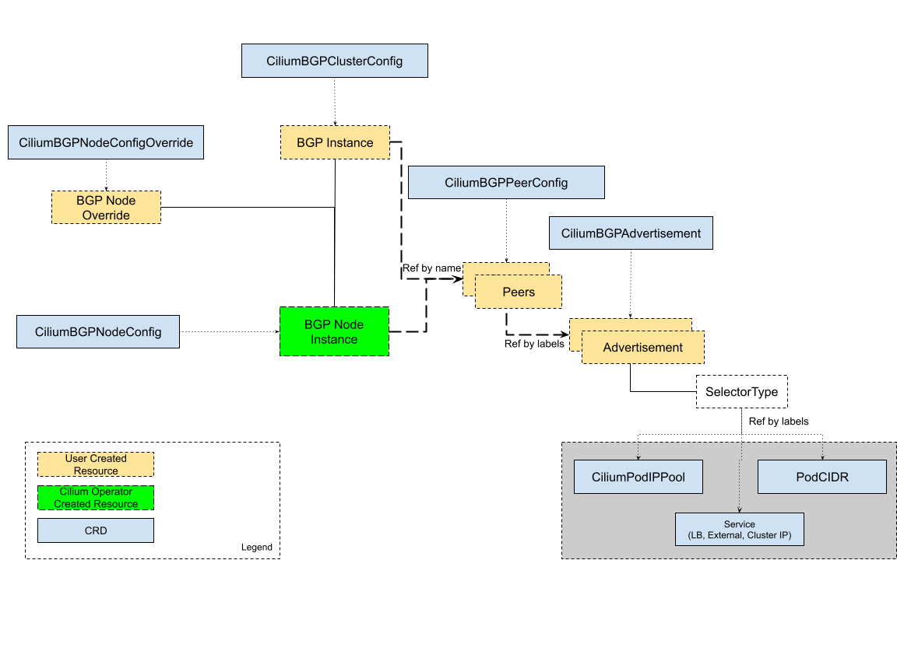

# BGP控制面Resource

Cilium的BGP控制面由一组自定义资源管理，提供BGP peer、策略、发布的配置。

包括：

- `CiliumBGPClusterConfig`：定义BGP实例和peer配置。
- `CiliumBGPPeerConfig`：公共的BGP peer配置。用于多个peer。
- `CiliumBGPAdvertisement`：注入到BGP路由表中的前缀。
- `CiliumBGPNodeConfigOverride`：节点相关的BGP配置。

各资源关系如下：



## BGP集群配置

`CiliumBGPClusterConfig`定义的BGP配置作用于一个或多个集群节点，具体要看它的`nodeSelector`。每个`CiliumBGPClusterConfig`定义了一个或多个BGP实例，由它们的`name`唯一标识。

一个BGP实例可以有多个peer。每个peer由其`name`唯一标识。Peer自治号以及peer地址由`peerASN`和`peerAddress`定义。Peer的配置由`peerConfigRef`指定，它引用了一个peer配置资源。`peerConfigRef`中的`Group`和`kind`是可选的，默认是`cilium.io`、`CiliumBGPPeerConfig`。

> 警告，`CiliumBGPPeeringPolicy`和`CiliumBGPClusterConfig`不要一起用。如果都加了，Cilium根据node selector选中的相同节点会以`CiliumBGPPeeringPolicy`的优先。

下面的例子中配置了一个名为`instance-65000`的BGP实例，其下有两个peer。

```yaml
apiVersion: cilium.io/v2alpha1
kind: CiliumBGPClusterConfig
metadata:
  name: cilium-bgp
spec:
  nodeSelector:
    matchLabels:
      rack: rack0
  bgpInstances:
  - name: "instance-65000"
    localASN: 65000
    peers:
    - name: "peer-65000-tor1"
      peerASN: 65000
      peerAddress: fd00:10:0:0::1
      peerConfigRef:
        name: "cilium-peer"
    - name: "peer-65000-tor2"
      peerASN: 65000
      peerAddress: fd00:11:0:0::1
      peerConfigRef:
        name: "cilium-peer"
```

## BGP Peer配置

`CiliumBGPPeerConfig`用来定义一个BGP peer配置。多个peer可以共用同一个配置，引用同一个`CiliumBGPPeerConfig`。

`CiliumBGPPeerConfig`资源包含以下配置：

- MD5密码
- 定时器
- EBGP Multihop
- 优雅重启
- Transport
- 地址族

下面是一个`CiliumBGPPeerConfig`的例子。后面会过一下里面的每个配置。

```yaml
apiVersion: cilium.io/v2alpha1
kind: CiliumBGPPeerConfig
metadata:
  name: cilium-peer
spec:
  timers:
    holdTimeSeconds: 9
    keepAliveTimeSeconds: 3
  authSecretRef: bgp-auth-secret
  ebgpMultihop: 4
  gracefulRestart:
    enabled: true
    restartTimeSeconds: 15
  families:
    - afi: ipv4
      safi: unicast
      advertisements:
        matchLabels:
          advertise: "bgp"
```

### MD5密码

`AuthSecretRef`可以设置一个基于[RFC-2385](https://www.rfc-editor.org/rfc/rfc2385.html)的TCP MD5密码。

它的值应该是引用BGP密钥namespace（用Helm安装的话默认是`kube-system`）中的一个Secret的名字。其中应该包含一个名为`password`的key。

BGP密钥保存在指定的namespace中，这样可以把权限范围控制起来。Helm会默认为Cilium做好相关配置。

下面是一个创建Secret的例子：

```shell
kubectl create secret generic -n kube-system --type=string secretname --from-literal=password=my-secret-password
```

如果要改namespace，需要改Helm的chart value`bgpControlPlane.secretNamespace.name`。如果需要自动创建namespace，还要将`bgpControlPlane.secretNamespace.create`设置为`true`。

由于TCP MD5是对数据包的header进行签名，如果Cilium对会话做了地址转换就不能用了（就是说Cilium Agent的Pod IP地址必须是BGP对端能看到的）。

如果密码不对，或者header被改了，TCP就连不上。Cilium Agent的日志中会有`dial: i/o timeout`而非特别具体的错误。

如果Cilium找不到`authSecretRef`，BGP会话就会使用一个空密码，agent会有如下日志：

```text
level=error msg="Failed to fetch secret \"secretname\": not found (will continue with empty password)" component=manager.fetchPeerPassword subsys=bgp-control-plane
```

### 定时器

支持以下定时器参数。详见[RFC4271](https://datatracker.ietf.org/doc/html/rfc4271)。

名称|配置字段|默认值
-|-|-
ConnectRetryTimer|`connectRetryTimeSeconds`|120
HoldTimer|`holdTimeSeconds`|90
KeepaliveTimer|`keepAliveTimeSeconds`|30

如果是在数据中心部署，通常建议把`HoldTimer`和`KeepaliveTimer`设置的更小一点，可以更快的发现问题。比如最小的可能值设置为`holdTimeSeconds=9`、`keepAliveTimeSeconds=3`。

与对端失联后如果要确保快速恢复，可以降低`connectRetryTimeSeconds`（比如设置成`5`或者更小）。因为内部实现的时候会有随机的抖动，`ConnectRetryTimer`的真实值在`[ConnectRetryTimeSeconds, 2 * ConnectRetryTimeSeconds)`这个区间。

```yaml
apiVersion: cilium.io/v2alpha1
kind: CiliumBGPPeerConfig
metadata:
  name: cilium-peer
spec:
  timers:
    connectRetryTimeSeconds: 5
    holdTimeSeconds: 9
    keepAliveTimeSeconds: 3
```

### EBGP Multihop

eBGP默认将BGP数据包的IP TTL设置为1。通常不建议改这个东西，但有的时候可能也要改一下。比如BGP对端是位于不同子网的一个路由器，那可能就要改成大于1的。

```yaml
apiVersion: cilium.io/v2alpha1
kind: CiliumBGPPeerConfig
metadata:
  name: cilium-peer
spec:
  ebgpMultihop: 4 # <-- specify the TTL value
```

### 优雅重启

可以把控制面配置成一个优雅重启的`Restarting Speaker`。启用优雅重启后，BGP会话重启，“优雅重启”功能会在BGP OPEN消息中广播出来。

当Cilium Agent重启时，对端BGP路由器不会立刻去掉控制面发来的路由。在Agent重启过程中datapath会继续进行流量转发，因此不会有流量出现中断。

可以设置一个`restartTimeSeconds`参数。`RestartTime`指的是Cilium的BGP控制面重启后预计会在此时间内重新建立BGP会话。超过`RestartTime`后对端就会删除由控制面发来的之前的路由信息。

```yaml
apiVersion: cilium.io/v2alpha1
kind: CiliumBGPPeerConfig
metadata:
  name: cilium-peer
spec:
  gracefulRestart:
    enabled: true
    restartTimeSeconds: 15
```

Cilium Agent重启时会关闭BGP TCP套接字，触发一个TCP FIN包。对端收到FIN包后会将BGP的状态改为`Idle`并启动`RestartTime`定时器。

Cilium Agent的启动时间视部署情况而定。如果用了`RestartTime`，那就应该把它设置成比启动时间更长的一个值。

`RetartTime`默认120秒。详见[RFC-4724](https://www.rfc-editor.org/rfc/rfc4724.html)和[RFC-8538](https://www.rfc-editor.org/rfc/rfc8538.html)。

### Transport

这个可以用来自定义BGP会话对端的目的端口。

默认情况下， 当BGP工作在[active mode](https://datatracker.ietf.org/doc/html/rfc4271#section-8.2.1)（由Cilium agent发起TCP连接）时，目的端口为179，源端口则临时选取。

```yaml
apiVersion: cilium.io/v2alpha1
kind: CiliumBGPPeerConfig
metadata:
  name: cilium-peer
spec:
  transport:
    peerPort: 179
```

### 地址族

`families`参数包含一个AFI(Address Family Identifier)列表，SAFI(Subsequent Address Family Identifier)对儿，以及广播(advertisement)选择器。目前支持的AFI/SAFI选项只有`{afi: ipv4, safi: unicast}`和`{afi: ipv6, safi: unicast}`。

如果默认没有配置地址族，BGP控制面会同时发送IPv4和IPv6 Unicast Multiprotocol Extensions Capability([RFC-4760](https://www.rfc-editor.org/rfc/rfc4760.html))到对端。

> 注意，如果没有匹配的广播(advertisement)，给对端发送的广播就不会增加前缀。默认配置中不会增加任何广播前缀。

```yaml
apiVersion: cilium.io/v2alpha1
kind: CiliumBGPPeerConfig
metadata:
  name: cilium-peer
spec:
  families:
    - afi: ipv4
      safi: unicast
      advertisements:
        matchLabels:
          advertise: "bgp"
    - afi: ipv6
      safi: unicast
      advertisements:
        matchLabels:
          advertise: "bgp"
```

## BGP广播(Advertisements)

`CiliumBGPAdvertisement`这个资源用来配置各种广播类型和相关属性。上面配置中的`advertisements`标签选择器可以匹配一个或多个`CiliumBGPAdvertisement`资源。

### BGP属性(Attributes)

在`advertisements[*]`中包含`attributes`参数，可以用来配置被广播出去的前缀的BGP path属性。可以配置两种Path Attribute：`Communities`、`LocalPreference`。

比如：

```yaml
apiVersion: cilium.io/v2alpha1
kind: CiliumBGPAdvertisement
metadata:
  name: bgp-advertisements
  labels:
    advertise: bgp
spec:
  advertisements:
    - advertisementType: "PodCIDR"
      attributes:
        communities:
          standard: [ "65000:99" ]
        localPreference: 99
```

#### Community

它定义了一组值，通过BGP Communities Path Attributes进行广播。

值可以是以下三种：

- `Standard`:表示用一个“标准的”32位BGP Communities Attribute([RFC-1997](https://www.rfc-editor.org/rfc/rfc1997.html))值来表示一个4字节数字或两个用冒号隔开的2字节数字(比如`64512:100`)。
- `WellKnown`:表示用一个“标准的”32位BGP Communities Attribute([RFC-1997](https://www.rfc-editor.org/rfc/rfc1997.html))值来表示一个已知数字的别名。可用值以及对应的数字如下表：

  别名|16进制值|16位Pair Value
  -|-|-
  `internet`|`0x00000000`|`0:0`
  `planned-shut`|`0xffff0000`|`65535:0`
  `accept-own`|`0xffff0001`|`65535:1`
  `route-filter-translated-v4`|`0xffff0002`|`65535:2`
  `route-filter-v4`|`0xffff0003`|`65535:3`
  `route-filter-translated-v6`|`0xffff0004`|`65535:4`
  `route-filter-v6`|`0xffff0005`|`65535:5`
  `llgr-stale`|`0xffff0006`|`65535:6`
  `no-llgr`|`0xffff0007`|`65535:7`
  `blackhole`|`0xffff029a`|`65535:666`
  `no-export`|`0xffffff01`|`65535:65281`
  `no-advertise`|`0xffffff02`|`65535:65282`
  `no-export-subconfed`|`0xffffff03`|`65535:65283`
  `no-peer`|`0xffffff04`|`65535:65284`

- `Large`:表示一个BGP Large Communities Attribute([RFC-8092](https://www.rfc-editor.org/rfc/rfc8092.html))，代表三个用冒号隔开的数字（比如`64512:100:50`）。

#### Local Perference

它定义了一个偏好值。由于Local Preference仅在`iBGP`对端之间有效，会被`eBGP`对端忽略掉（不会广播Local Preference Path Attribute）。

### Advertisement Type

Cilium支持以下两种类型：

- Pod CIDR
- Service虚拟IP

#### Pod CIDR

BGP控制面可以广播节点的Pod CIDR前缀。这样BGP对端以及相连的网络就可以不经过负载均衡或NAT，直接访问Pod。根据IPAM模式的不同，由两种方式广播PodCIDR。

> 注意，Cilium BGP控制面只广播分配给节点的Pod CIDR，不会广播整个范围。

##### Kubernetes以及ClusterPool IPAM

如果使用Kubernetes或ClusterPool IPAM，要设置成`PodCIDR`。

```yaml
apiVersion: cilium.io/v2alpha1
kind: CiliumBGPAdvertisement
metadata:
  name: bgp-advertisements
  labels:
    advertise: bgp
spec:
  advertisements:
    - advertisementType: "PodCIDR"
```

按此配置，节点上的BGP实例就会广播所在节点对应的Pod CIDR前缀。

##### MultiPool IPAM

略

##### 其他IPAM

使用其他IPAM不支持广播Pod CIDR。

#### Service虚拟IP

在Kubernetes中，一个Service可以有多个虚拟IP，比如`.spec.clusterIP`、`.spec.clusterIPs`、`.status.loadBalancer.ingress[*].ip`、`.spec.externalIPs`。

BGP控制面可以把Service的虚拟IP广播给BGP对端。这样就可以在集群外部直接访问Service了。

> 注意，Cilium BGP控制面会广播虚拟IP的完整路径（/32或/128）。

实现这个功能需要将`advertisementType`设置为`Service`，`service.addresses`设置为`LoadBalancerIP`、`ClusterIP`或`ExternalIP`。

`.selector`是一个标签选择器，选中和`.matchLabels`或`matchExpressions`匹配的Service。

```yaml
apiVersion: cilium.io/v2alpha1
kind: CiliumBGPAdvertisement
metadata:
  name: bgp-advertisements
  labels:
    advertise: bgp
spec:
  advertisements:
    - advertisementType: "Service"
      service:
        addresses:
          - ClusterIP
          - ExternalIP
          - LoadBalancerIP
      selector:
        matchExpressions:
          - { key: bgp, operator: In, values: [ blue ] }
```

如果你的上游路由器支持Equal Cost Multi Path(ECMP)，可以利用这个特性实现多个节点到Service的流量负载均衡，从多个节点上广播同一个虚拟IP。