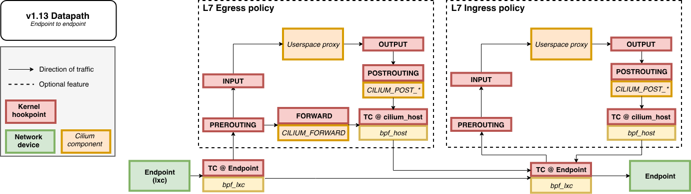
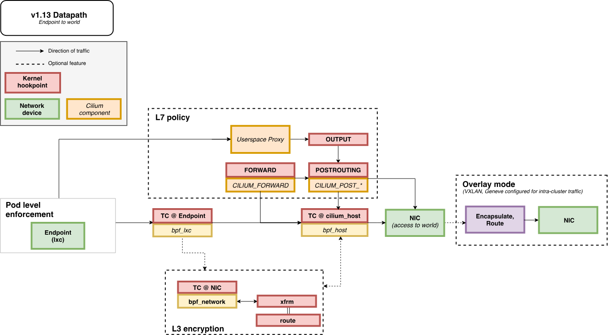
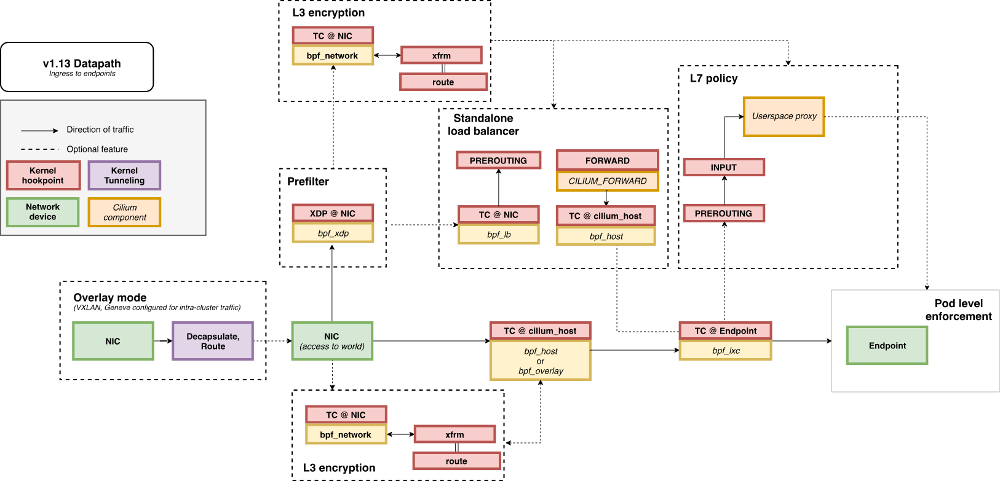

# Package的生命周期

这里我们从eBPF datapath的视角来看一个package的生命周期，一共是三种场景。

## Endpoint到Endpoint

首先我们来看本机端到端的情况，并且对于egress和ingress都加上了可选的7层策略。下面就是这个图了，还启用了socket层的策略。启用了socket层策略后，发起连接的握手请求会遍历endpoint策略对象，直到TCP状态变成ESTABLISHED。然后就只需要7层策略对象了。

## Endpoint到Egress

这个是本地endpoint到egress了，带了可选的overlay网络。在overlay网络中，流量会转发到overlay对应的Linux网络接口。默认的overlay接口名为cilium_vxlan。和上面的图类似，启用了socket层策略后，并且还有7层代理，对于TCP流量，可以避免在endpoint和7层策略之间再次运行endpoint策略。同时还可以打开可选的3层加密。

## Ingress到Endpint

这个是ingress到本地endpoint，也是带了可选的overlay网络。额外配备跟上面的也都类似。如果数据包做了加密，首先需要解密。

