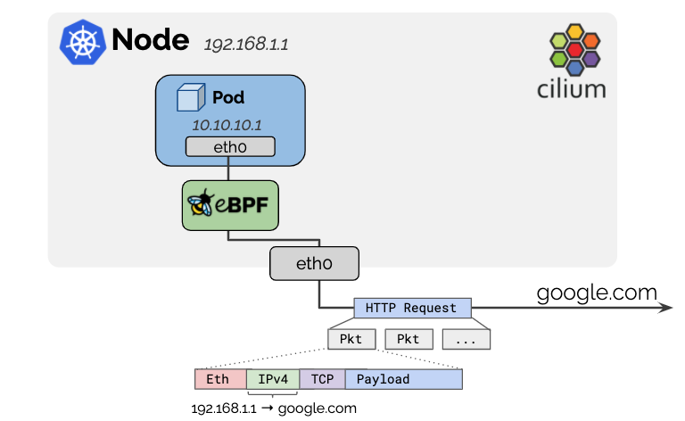

# Masquerading

Pod用的IPv4地址通常都是从RFC1918私有地址块分配的，外面都看不到。Cilium会自动将离开集群的流量的源地址伪装成集群节点的IP，这样到了外面就认识了。



可以用`enable-ipv4-masquerade: false`、`enable-ipv6-masquerade: false`关闭伪装。

## 配置

### 设置可路由的CIDR

默认是排除掉落入节点本地CIDR的目的IP。如果Pod IP能在更大的网络中进行路由，可以通过`ipv4-native-routing-cidr: 10.0.0.0/8`、`ipv6-native-routing-cidr: fd00::/100`设置，在该范围内的IP**不会**被伪装。

如果是公有云环境，不设置`ipv4-native-routing-cidr`的话Cilium会自动检测VPC的CIDR作为本地路由。Cilium不会伪装本地可路由网络中的源地址，因为两端无需NAT就能通信。因此如果启用伪装，从Pod去往其他同一个VPC中的非集群资源的流量就不会做源地址伪装，会直接路由。

### 设置伪装接口

看下面

## 实现模式

### 基于eBPF

> 注意
> IPv6的BPF伪装还处于beta阶段。遇到问题到GitHub发issue。IPv4的BPF伪装已经可以用于生产环境了。

这种模式的实现效率最高。可以通过helm的`bpf.masquerade=true`启用。


默认情况下，使用BPF伪装会同时启用BPF主机路由模式。详见[eBPF主机路由](../../运维/性能与伸缩性/调优.md#ebpf主机路由)。

目前的实现依赖于[BPF NodePort](../Kubernetes网络/替换kube-proxy.md)。后面会去掉这种依赖。

只有运行了eBPF伪装程序才会执行伪装。即当输出设备运行了该程序后，从Pod发往外部的数据包会进行伪装（伪装成输出设备）。如果没有指定设备，程序会根据[BPF NodePort设备探测机制](../Kubernetes网络/替换kube-proxy.md#nodeport设备端口以及绑定设置)自动挂靠在设备上。可以通过helm的`devices`选项来手动修改。`cilium status`可以看到程序目前运行在哪个设备上：

```shell
$ kubectl -n kube-system exec ds/cilium -- cilium-dbg status | grep Masquerading
Masquerading:   BPF (ip-masq-agent)   [eth0, eth1]  10.0.0.0/16
```

从上面的输出可以看到，程序现在运行在`eth0`和`eth1`两个设备上。

基于eBPF的伪装可以对以下4层协议的数据包进行伪装：

- TCP
- UDP
- ICMP

> 对于ICMP的支持仅限于Echo请求响应以及错误信息“Destination unreachable, fragmentation required, and DF flag set”。

默认情况下从一个Pod发往`ipv4-native-routing-cidr`外部IP的数据包会被伪装，除了那些发往其他集群节点的数据包。如上面展示的`10.0.0.0/16`。

> 使用eBPF伪装的时候，从Pod发往集群中的External IP的流量不会做伪装。这便是eBPF实现与iptables实现的不同之处。见[GitHub issue 17177](https://github.com/cilium/cilium/issues/17177)。

如果需要更详细的控制，Cilium用eBPF实现了[ip-masq-agent](https://github.com/kubernetes-sigs/ip-masq-agent)，可以通过helm的`ipMasqAgent.enabled=true`启用。

基于eBPF的ip-masq-agent支持配置文件中的`nonMasqueradeCIDRs`、`masqLinkLocal`、`masqLinkLocalIPv6`。由Pod发往`nonMasqueradeCIDRs`CIDR的数据包不会被伪装。如果配置文件是空的，agent会生成以下非伪装CIDR：

- `10.0.0.0/8`
- `172.16.0.0/12`
- `192.168.0.0/16`
- `100.64.0.0/10`
- `192.0.0.0/24`
- `192.0.2.0/24`
- `192.88.99.0/24`
- `198.18.0.0/15`
- `198.51.100.0/24`
- `203.0.113.0/24`
- `240.0.0.0/4`

同时，如果`masqLinkLocal`没有设置或者设置成了false，还会向以上列表中添加`169.254.0.0/16`。对于`masqLinkLocalIPv6`则是`fe80::/10`。

agent会通过Fsnotify跟踪配置文件的更新，不用配置`resyncInterval`。

下面展示了如何用[ConfigMap](https://kubernetes.io/docs/tasks/configure-pod-container/configure-pod-configmap/)配置agent并进行校验：

```yaml
apiVersion: v1
kind: ConfigMap
metadata:
  name: ip-masq-agent
data:
  config: |
    nonMasqueradeCIDRs:
    - 10.0.0.0/8
    - 172.16.0.0/12
    - 192.168.0.0/16
    masqLinkLocal: true
```

```shell
$ kubectl create -n kube-system -f https://raw.githubusercontent.com/cilium/cilium/v1.17/examples/kubernetes-ip-masq-agent/rfc1918.yaml

$ # Wait ~60s until the ConfigMap is propagated into the configuration file

$ kubectl -n kube-system exec ds/cilium -- cilium-dbg bpf ipmasq list
IP PREFIX/ADDRESS
10.0.0.0/8
172.16.0.0/12
192.168.0.0/16
```

也可以在用Helm安装Cilium的时候用`--set ipMasqAgent.config.nonMasqueradeCIDRs='{10.0.0.0/8,172.16.0.0/12,192.168.0.0/16}'`和`--set ipMasqAgent.config.masqLinkLocal=false`来配置`ip-masq-agent`。

### 基于eBPF

遗留的实现，略。