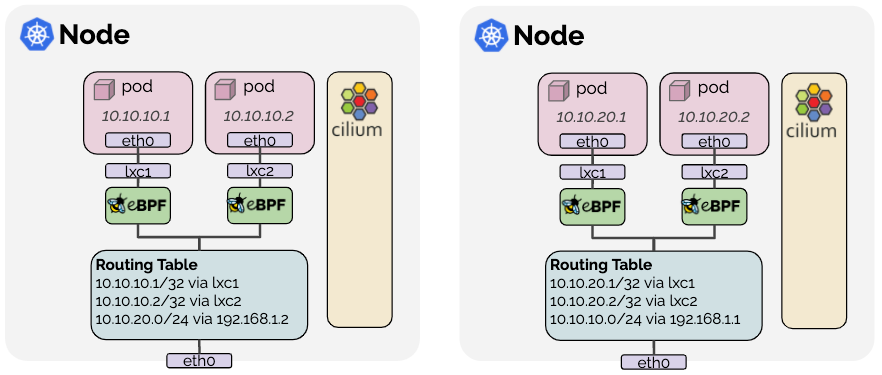

# 路由

## 封装

Cilium默认就工作在这种模式下，因为它对底层网络基建的要求最少。

这种模式下，所有集群节点组成一种隧道mesh，使用基于UDP的封装协议，例如[VXLAN](https://tools.ietf.org/html/rfc7348)或[Geneve](https://tools.ietf.org/html/rfc8926)。Cilium节点间的所有流量都做了封装。

### 网络要求

- 依赖基本的节点间的连通性。也就是说如果Cilium节点间互通，那么久已经满足此时的路由要求了。
- 底层网络需要支持IPv4。至于IPv6的隧道详见[GitHub issue 17240](https://github.com/cilium/cilium/issues/17240)。
- 底层网络和防火墙需要放行封装数据包：

    封装模式|端口范围/协议
    -|-
    VXLAN(默认)|8472/UDP
    Geneve|6081/UDP

### 优点

#### 简单

负责集群节点连通的网络无需知晓PodCIDR。集群可以划分出多个路由或链路层的域。只要节点间可以用IP/UDP互通，底层网络就没啥相关的事儿了。

#### 地址空间

由于没有了底层网络的限制，可用的地址空间就变大了，只要PodCIDR配置得当，每个节点上的Pod数量可以随意设定。

#### 自动配置

和编排系统一同工作时，比如Kubernetes，集群中的所有节点以及关联的分配前缀节点都自动提供给了每一个agent。新节点加入后会自动并入当前mesh。

#### 身份上下文

封装协议可以给网络数据包带上元数据。Cilium就利用了这种能力来传输元数据，比如来源安全身份标识。传输了身份标识就可以避免去远程节点再去查验身份。

### 缺点

#### MTU占用

由于加了封装头，实际可用的MTU相对于原生路由就变少了（VXLAN每个数据包要用50个字节）。这样对于一个特定的网络连接，导致它的最大吞吐率下降。可以启用巨型帧来最大程度上的缓解这个问题（相比于每1500字节产生50字节开销，变为每9000字节产生50字节开销）。

## 原生路由

通过`routing-mode: native`启用原生路由，以及原生数据包转发模式。这种原生的数据包转发能力利用了Cilium所在网络的路由能力，而非封装。

在原生路由模式中，Cilium会将所有指向非本地目标的数据包代理到Linux内核的路由子系统。就是说这个数据包在路由的时候就像是一个本地进程发出的数据包一样。其结果就是，集群节点的网络必须要能够路由PodCIDR。

配置了原生路由后Cilium自动为Linux内核启用IP转发。

### 网络要求

- 如果要跑原生路由，Cilium所在的集群网络必须具备转发Pod或其他负载IP的能力。
- Linux内核必须知道该如何在各个节点间转发Pod或其他负载的数据包。这通过以下两种方式实现：
    1. 节点自身不知道如何路由所有Pod IP，但网络中的某个路由器有这个能力。这种场景下，Linux配置一个默认的路由到这个路由器。这种模式用于云厂商网络集成。详见[Google Cloud](#google-cloud)、[AWS ENI](#aws-eni)、[Azure IPAM](./IP地址管理（IPAM）/Azure%20IPAM.md)。
    2. 每个节点都知晓其他所有节点上的Pod IP，对应的路由规则会插入到Linux内核的路由表中。如果所有节点处于同一个2层网络中，可以通过`auto-direct-node-routes: true`自动配置。否则就需要一个额外的系统组件，比如BGP，来分发路由。[这里](./BGP/使用Kube-Router运行BGP（已废弃）.md)介绍了如何用kube-router项目来实现。

## AWS ENI

略

## Google Cloud

略